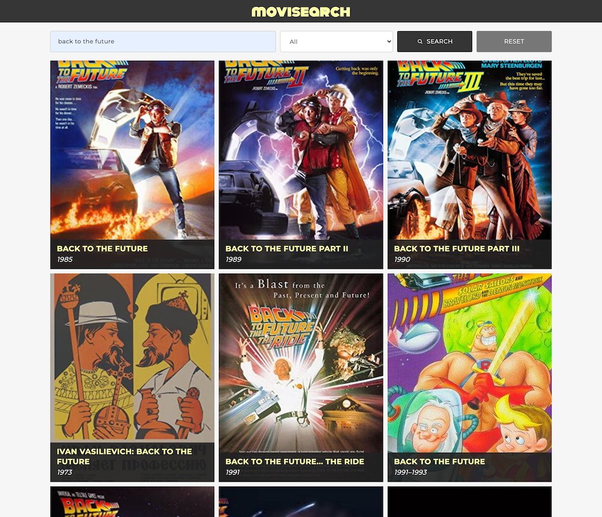
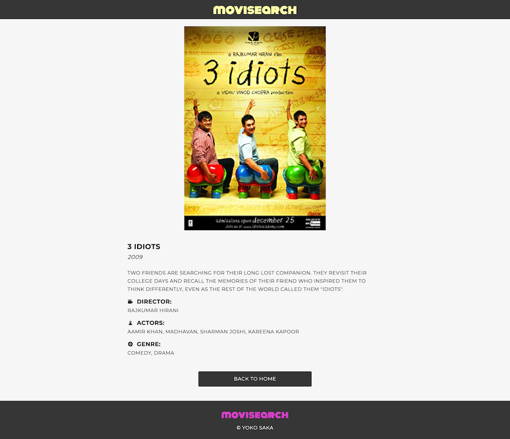

# Movisearch - Catalogue of Movies with React & Redux

**Search Result** 

**Movie Detail** 

## About the Project
Movisearch was built based on the idea of a "Catalogue of Recipes" which is a single-page application with React and Redux, showing a browsable list of movies that users can filter and access to the details of each movie.

The movies' data are retrieved from the Open Movie Database, [OMDb API](https://www.omdbapi.com/).
Once you input a keyword and choose the ages that the movie released, the app will retrieve the movies list from this API, and show them as a list on the main page.

When you click a certain movie's image from the list, it's going to show the movie's detail on the detail page.

Watch the explanation of this project on [YouTube](https://www.youtube.com/watch?v=vOBL0obe7_A) 

A list of commonly used resources that I find helpful is listed in the acknowledgments.

## Built With

* [React](https://reactjs.org/)
* [Redux](https://redux.js.org/)
* [JavaScript](https://en.wikipedia.org/wiki/JavaScript)
* HTML5
* SCSS

## Live Demo
[Live Demo Link](https://catalogue-of-movies-yoko.herokuapp.com/)

## Video Explanation
[YouTube](https://www.youtube.com/watch?v=vOBL0obe7_A) 

## Getting Started

To get a local copy up and running follow these simple example steps.

1. On the project GitHub page, navigate to the main page of the repository.
2. Under the repository name, locate and click on a green button named `Code`. 
3. Copy the project URL as displayed.
4. If you're running the Windows Operating System, open your command prompt. On Linux, Open your terminal. 
5. Change the current working directory to the location where you want the cloned directory to be made. Leave as it is if the current location is where you want the project to be. 
6. Type git clone, and then paste the URL you copied in Step 3.  
e.g. $ git clone https://github.com/yourUsername/yourProjectName 
7. Press Enter. Your local copy will be created. 
8. Create .env file in the local folder, inside it, write your own [OMDb API](https://www.omdbapi.com/) key like `REACT_APP_OMDB_API_KEY=xxxxxxx`. It's free to issue your key.
9. To install all dependencies, run `npm install`
10. To run the server in your local environment, run `npm start`
11. To run the tests, run `npm test`

## Author

👤 **Yoko Saka**

- GitHub: [@yocosaka](https://github.com/yocosaka)
- Twitter: [@yocosaka](https://twitter.com/yocosaka)
- LinkedIn: [Yoko Saka](https://www.linkedin.com/in/yokosaka)

## Contributing

Contributions, issues, and feature requests are welcome!
Feel free to check the [issues page](../../issues).

1. Fork the Project
2. Create your Feature Branch (`git checkout -b feature/AmazingFeature`)
3. Commit your Changes (`git commit -m 'Add some AmazingFeature'`)
4. Push to the Branch (`git push origin feature/AmazingFeature`)
5. Open a Pull Request

## Show your support

Give a ⭐️ if you like this project!

## License

This project is [MIT](./LICENSE) licensed.

## Acknowledgements
* [OMDb API](https://www.omdbapi.com/)
* [Axios](https://github.com/axios/axios)
* [React Testing Library](https://github.com/testing-library/react-testing-library)
* [uuid](https://github.com/uuidjs/uuid)
* [eslint](https://eslint.org/)
* [stylelint](https://stylelint.io/)
* [Prop Types](https://www.npmjs.com/package/prop-types)
* [Heroku](https://dashboard.heroku.com/)
* [Pixabay](https://pixabay.com/)
* [React Icons](https://react-icons.github.io/react-icons/)
